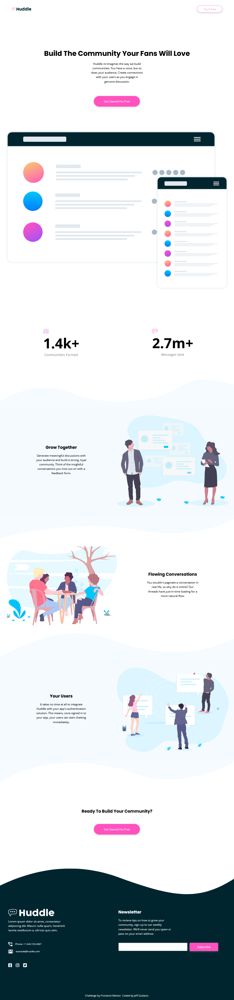

# Frontend Mentor - Huddle landing page with curved sections solution

This is a solution to the [Huddle landing page with curved sections challenge on Frontend Mentor](https://www.frontendmentor.io/challenges/huddle-landing-page-with-curved-sections-5ca5ecd01e82137ec91a50f2). Frontend Mentor challenges help you improve your coding skills by building realistic projects.

## Table of contents

- [Overview](#overview)
  - [The challenge](#the-challenge)
  - [Screenshot](#screenshot)
  - [Links](#links)
- [My process](#my-process)
  - [Built with](#built-with)
  - [What I learned](#what-i-learned)
  - [Continued development](#continued-development)
  - [Useful resources](#useful-resources)
- [Author](#author)

## Overview

### The challenge

Users should be able to:

- View the optimal layout for the site depending on their device's screen size
- See hover states for all interactive elements on the page

### Screenshot



This is a screenshot of the final edit in Firefox.

### Links

- Solution URL: [GitHub Repo](https://github.com/jgiuliano8/FEM-huddle-landing-page-with-curved-sections)
- Live Site URL: [Vercel Site](https://fem-huddle-landing-page-with-curved-sections.vercel.app/)

## My process

### Built with

- Semantic HTML5 markup
- CSS3
- Flexbox
- CSS Grid
- SVGs

### What I learned

Working with SVGs and making them responsive was
a learning process. It took me some time to scour
the web and finally tweak a solution. I pulled the
'height' and 'width' attributes out of the SVGs
to make them responsive. Then I put them in
adjacent divs to make sections look like they had
curved borders. But I was getting a bad effect
where there would be a line, sometimes, between
the SVG and the adjacent section. So I finally
came across a solution that I tweaked to fit my
project:

```css
.pixel-fix {
  transform: scale(1, 1.05);
  overflow: visible;
}
```

I scaled the SVGs in the Y direction only and then
made the overflow visible. (Initially I scaled
the entire SVG at 1.05 but that caused
side-scrolling. So I scaled the X direction at a
1 which of course does not change anything in the
X direction.)

### Continued development

I probably need to understand and use SVGs more
deeply. Maybe more projects with SVGs.

### Useful resources

- [Stack overflow](https://stackoverflow.com/)
- [MDN](https://developer.mozilla.org/en-US/)

## Author

- Website - [Jeff Giuliano](https://github.com/jgiuliano8)
